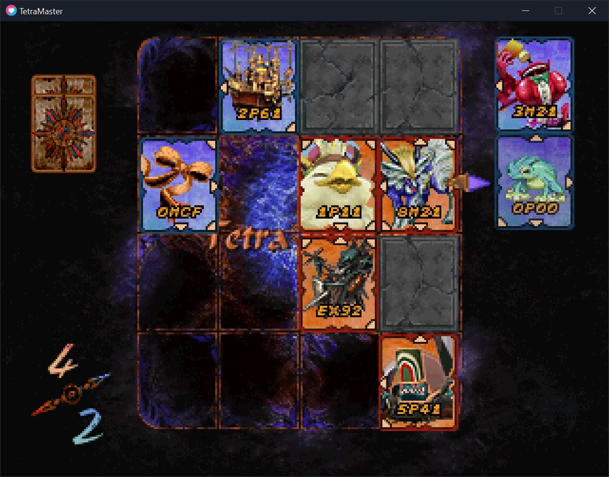
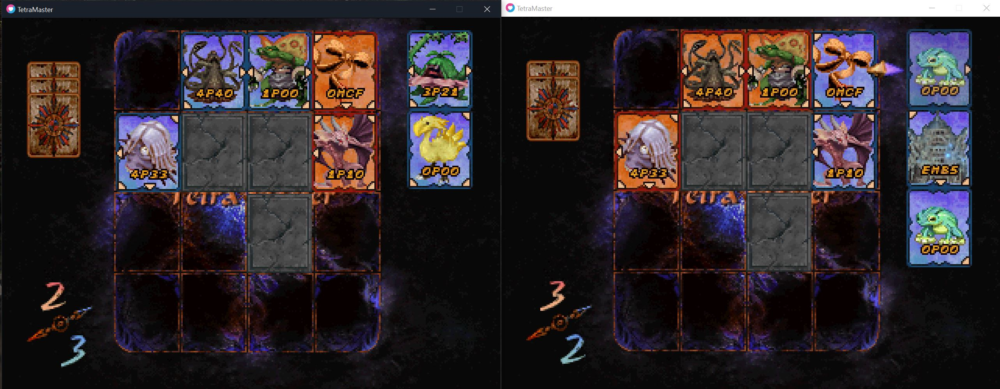

# Tetra Master

A port of the FFIX Tetra Master card minigame, packaged as a Windower addon for FFXI players.

This folder is both the game project and the Windower addon (`<Windower>\addons\TetraMaster\`).

## Installation (players)

Download the latest release zip (`TetraMaster.zip` or `TetraMaster-<version>.zip`) and extract it into your Windower addons folder:

```
<Windower>\addons\TetraMaster\
```

The zip includes the pre-built game in `runtime\` (no build step required). After extracting:

```
//lua load TetraMaster
```

Reload after updates:

```
//lua reload TetraMaster
```

## Building from source (developers)

Requirements:

- [LOVE 11.5](https://love2d.org/) installed (default path: `C:\Program Files\LOVE\love.exe`)
- Windows PowerShell

Build the fused executable and copy it into `runtime\`:

```powershell
.\build\build-fused.ps1 -Release
```

Create a release zip (includes `runtime\`, excludes `sync\`, `dist\`, and build tooling). By default the zip is written to your Desktop:

```powershell
.\build\package-release.ps1
```

Optional version label for the zip filename:

```powershell
.\build\package-release.ps1 -Version 1.0
```


## Windower addon (FFXI)

Load the addon in-game:

```
//lua load TetraMaster
```

The addon opens Tetra Master in a separate window. FFXI keeps running.

### Solo play

Play against the AI in your own game window.



| Command | Description |
| --- | --- |
| `//tm play` | Start a solo game |
| `//tm start` | Same as `//tm play` |
| `//tm help` | List all commands |

**Typical flow**

1. `//tm play`
2. Play against the AI until both hands are empty
3. After each game, a new match starts automatically after a short pause
4. Close the window or press **Escape** to quit

Shorthand `//tm` works for all commands above (`//tetramaster play` also works).

### Multiplayer (party duels)

Both players must be in the same party. The challenger hosts the game; the guest connects over TCP after accepting.



| Command | Description |
| --- | --- |
| `//tm duel <name>` | Challenge a party member by name |
| `//tm accept` | Accept a pending challenge (challenged player only) |
| `//tm decline` | Decline a pending challenge |
| `//tm resign` | Leave an active duel session |
| `//tm help` | List all commands |

**Typical flow**

1. Challenger: `//tm duel <player_name>`
2. Party chat announces the challenge; opponent sees `//tm accept` or `//tm decline` in addon chat
3. On accept, both clients launch a duel window automatically
4. After each game, a new match starts automatically after a short pause — keep playing until someone closes the window or uses `//tm resign`
5. Closing the game window or resigning ends the session for both players

Shorthand `//tm` works for all commands above (`//tetramaster duel ...` also works).

## Controls

- **Arrow keys** — move focus between hand and board
- **Enter** — select card / place card
- **Escape** — deselect card, or quit

