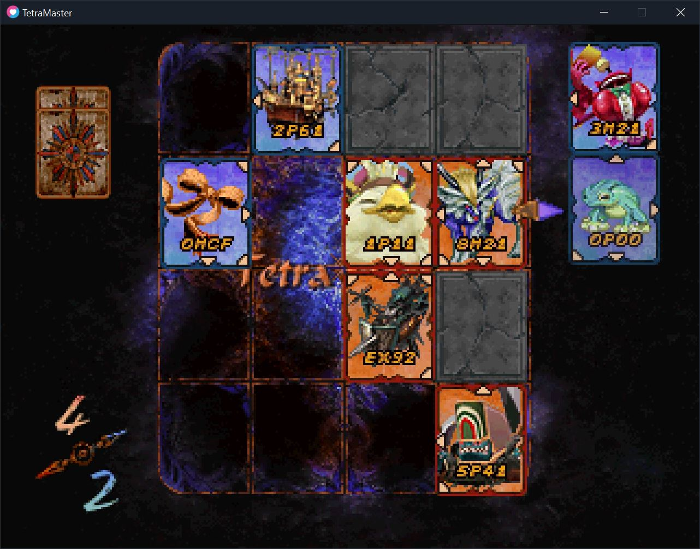
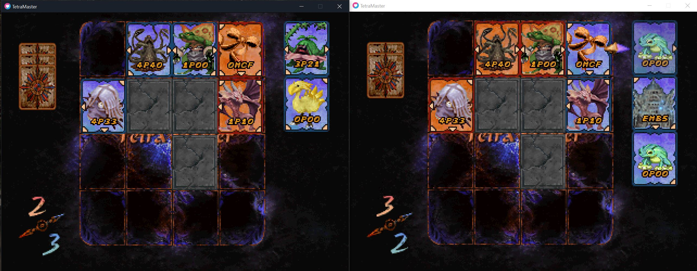

# Tetra Master

A port of the FFIX Tetra Master card minigame, packaged as a Windower addon for FFXI players.

## Download (players)

**Use [GitHub Releases](https://github.com/Nalfey/TetraMaster/releases)** — download `TetraMaster.zip` (or `TetraMaster-<version>.zip`).

Do **not** use the green **Code → Download ZIP** button on the main repo page. That is source code for development, not the ready-to-play addon.

### Install

1. Download the latest **release** zip from the link above.
2. Extract it into your Windower addons folder:

```
<Windower>\addons\TetraMaster\
```

You should end up with folders like `runtime\`, plus `TetraMaster.lua` and other `.lua` files — not a `build\` folder.

3. In FFXI:

```
//lua load TetraMaster
```

After an update:

```
//lua reload TetraMaster
```

## How to play

Load the addon in-game:

```
//lua load TetraMaster
```

The addon opens Tetra Master in a separate window. FFXI keeps running.

### Solo play

Play against the AI in your own game window.



| Command | Description |
| --- | --- |
| `//tm play` | Start a solo game |
| `//tm start` | Same as `//tm play` |
| `//tm help` | List all commands |

**Typical flow**

1. `//tm play`
2. Play against the AI until both hands are empty
3. After each game, a new match starts automatically after a short pause
4. Close the window or press **Escape** to quit

Shorthand `//tm` works for all commands above (`//tetramaster play` also works).

### Multiplayer (party duels)

Both players must be in the same party. Duels use a shared online relay — no port forwarding or VPN required.

Both clients connect automatically after challenge/accept.



| Command | Description |
| --- | --- |
| `//tm duel <name>` | Challenge a party member |
| `//tm accept` | Accept a pending challenge (challenged player only) |
| `//tm decline` | Decline a pending challenge |
| `//tm resign` | Leave an active duel session |
| `//tm help` | List all commands |

**Typical flow**

1. Challenger: `//tm duel <player_name>`
2. Party chat announces the challenge; opponent runs `//tm accept` or `//tm decline`
3. Both clients connect to the relay, then launch the duel window
4. After each game, a new match starts automatically — close the window or `//tm resign` to end

Shorthand `//tm` works for all commands (`//tetramaster duel ...` also works).

## Controls

- **Arrow keys** — move focus between hand and board
- **Enter** — select card / place card
- **Escape** — deselect card, or quit

---

Maintainers: release packaging and server deploy notes are in [`build/README.md`](build/README.md) (not needed to play).
